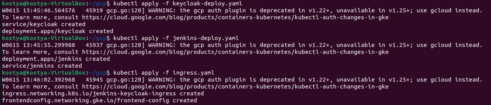
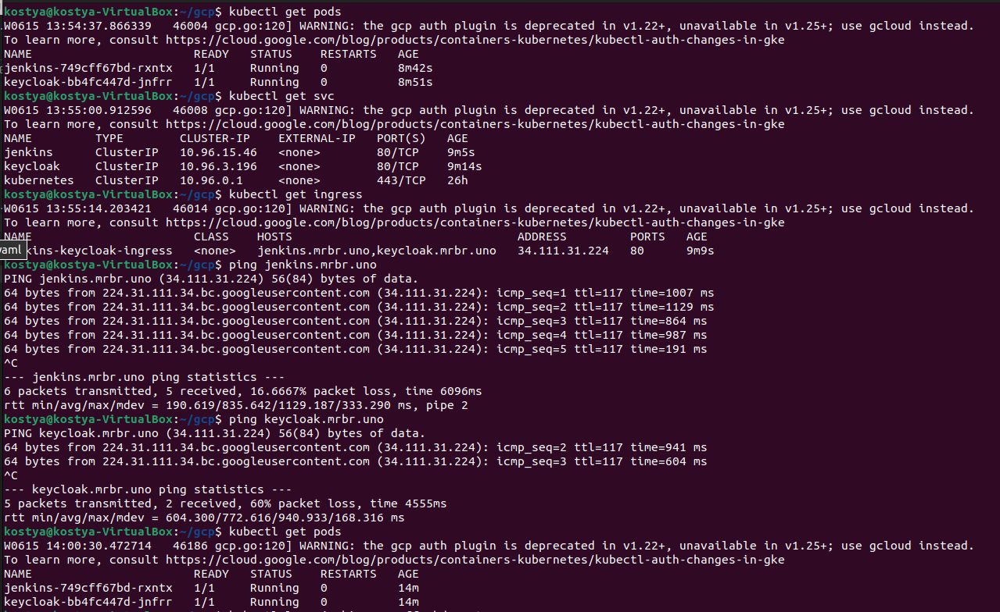
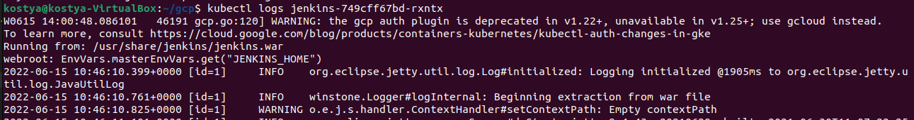

# Testing Task for DevOps

### Contact person: Mykola Marusenko

## Task:

1. Install Keycloak in Kubernetes cluster.

2. Install Jenkins in Kubernetes cluster.

3. «*» Integrate Keycloak with Jenkins (authorization procedure is via Keycloak).

### As the results, please provide/calculate the following:

- Estimations for task performance.

- Report about the tasks (screenshots, notices).

Before the interview, please make sure you have the report about your work to discuss it on the interview.

«*» The additional complex task to be performed if possibl

***

## Execution Instructions

1. *Create cluster.* 

2. *Create global ip.*

3. *Get certificate for domains:*

        - jenkins.mrbr.uno
        - keycloak.mrbr.uno
        - mrbr.uno

4. *Create persistent disk for Jenkins.*

5. *Create Ssl policy for FrontendConfig.*

6. *Apply deployment and service for Jenkins:*

    kubectl apply -f jenkins-deploy.yaml

7. *Apply deployment and service for Keycloak:*

    kubectl apply -f keycloak-deploy.yaml

8. *Apply Ingress and FrontendConfig.*

    kubectl apply -f ingress.yaml
  
  

9. *Check work.* 
  
   

10. *View log and find init-password for Jenkins.*   

   

11. *Integrate Keycloak with Jenkins*

12. *Working links:*   
[jenkins.mrbr.uno](jenkins.mrbr.uno)   
[keycloak.mrbr.uno](keycloak.mrbr.uno)   
